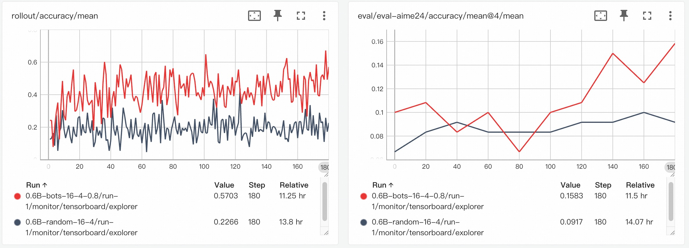

# Training Math Agent with Data-Augment Strategies

This example demonstrates how to use **AgentScope-Tuner** to enhance a math problem-solving agent. We will focus on leveraging **Data-Centric** features, such as the `difficulty_based` task selector, to improve data utility and training efficiency.

## Task Setting

We use the foundational [math-agent example](https://github.com/agentscope-ai/agentscope-samples/blob/main/tuner/math_agent/main.py) as our baseline. The agent is a **`ReActAgent`** that solves mathematical reasoning problems through step-by-step reasoning.

Training can be inefficient if tasks are too easy or too hard. This example demonstrates how to use **task selectors** to dynamically select tasks based on **data feedback**, focusing on "productively challenging" samples to maximize training efficiency. These data-centric techniques are generic and adaptable to other agent workflows.

## Dataset Preparation

To enable difficulty-based sampling, the training data must include difficulty features (e.g., pass rates from LLMs).

1.  **Base Dataset**: You can use any standard math problem dataset. A good example is the math data in [LLM360/guru-RL-92k](https://huggingface.co/datasets/LLM360/guru-RL-92k), which comes pre-annotated with pass rates from different LLMs, serving as direct difficulty features.
2.  **Build Your Own Features**: If you use your own dataset, you can generate these features by pre-running several models of varying capabilities and recording their pass rates. This can be done within the [**Trinity-RFT**](https://github.com/agentscope-ai/Trinity-RFT/pull/440) framework.
3.  **Data Format**: The final dataset should be in HuggingFace format. In this example, data will be transferred to *GSM8K format* according to the [workflow](https://github.com/agentscope-ai/agentscope-samples/blob/main/tuner/math_agent/main.py). Besides the task content, it must include the difficulty feature columns you've defined (e.g. `qwen2.5_7b_pass_rate`).
4.  **Example Data Preparation**: We provide a script for this example. Simply execute `python prepare_data.py` to generate the required dataset.

## Code Implementation

### Agent Workflow & Judge Function

This example follows the foundational [math-agent example](https://github.com/agentscope-ai/agentscope-samples/blob/main/tuner/math_agent/main.py), adopting its `run_react_agent` and `gsm8k_judge` as the `workflow_func` and `judge_func`, respectively. This highlights a key benefit: you can apply training strategies without altering your core agent logic.

### Design of Data-Centric Features

Leveraging the powerful data processing capabilities of **Trinity-RFT**, **AgentScope-Tuner** provides interfaces for advanced operations like task selection and experience processing.

#### Task Selector

The `Task Selector` determines how samples are selected from a dataset. It can be configured directly in configuration YAML files.

- **Built-in Selectors**:
  - `sequential`: Samples are selected in a fixed order.
  - `shuffle`: The dataset is shuffled at the beginning of each epoch.
  - `random`: Samples are randomly chosen with replacement for each batch.
  - `offline_easy2hard`: Samples are sorted by a predefined feature for curriculum learning.
  - `difficulty_based` (Customized): An adaptive sampler based on task difficulty.

> For more details on `Task Selector`, including how to implement a custom selector based on feedback signals, please refer to **Trinity-RFT**'s **[Selector Development Guide](https://agentscope-ai.github.io/Trinity-RFT/en/main/tutorial/develop_selector.html)**.

#### Data Processor

The `Data Processor` allows for real-time processing of **Task** and **Experience** during training, enabling operations like calculating feedback metrics, data augmentation, or filtering.

For example, the `difficulty_based` selector requires a `pass_rate_calculator` operator to compute the agent's success rate for each task. This feedback is then used to adjust the sampling strategy.

> For more details on `Data Processor`, please refer to **Trinity-RFT**'s **[Operator Development Guide](https://agentscope-ai.github.io/Trinity-RFT/en/main/tutorial/develop_operator.html)**.


### Configuring the Experiments

To maintain clarity and simplicity, we recommend defining all data-specific parameters, including dataset paths and task selectors, within YAML configuration files.

We provide two configuration files to compare the baseline `random` selector against the `difficulty_based` selector.

**Experiment 1: Baseline with Random Selector (`config_random.yaml`)**

In `config_random.yaml`, we configure the `task_selector` for random sampling under `buffer.explorer_input.taskset`.

```yaml
# In config_random.yaml
buffer:
  # ...
  explorer_input:
    taskset: # Training data
      path: "path/to/your/augmented/math_data"
      split: "train"
      task_selector:
          selector_type: random # Strategy of task selection
```

**Experiment 2: Advanced Training with Difficulty-Based Selector (`config_difficulty.yaml`)**

In `config_difficulty.yaml`, we switch the `task_selector` to difficulty_based and provide its specific parameters. Note that this config also enables the `pass_rate_calculator` needed for feedback.

```yaml
# In config_difficulty.yaml

# Enable the calculator to provide feedback for the selector
data_processor:
  experience_pipeline:
    operators:
      - name: pass_rate_calculator

buffer:
  # ...
  explorer_input:
    taskset: # Training data
      path: "path/to/your/augmented/math_data"
      split: "train"
      task_selector:
        selector_type: difficulty_based # Strategy of task selection
        feature_keys: [ "qwen2.5_7b_pass_rate", "qwen3_30b_pass_rate" ]
        kwargs: # Hyper-parameters for the selection algorithm
          m: 8
          # ...
```

> The `difficulty_based` selector in this example is an implementation of the ***BOTS*** algorithm. For details on its inner workings, please refer to the [***BOTS paper***](https://arxiv.org/abs/2510.26374) and its [***tutorials***](https://github.com/agentscope-ai/Trinity-RFT/blob/main/examples/bots/README.md).

## How to Run

### Step 1: Prerequisites

Ensure you have installed **AgentScope** and **Trinity-RFT** with [the guidance](https://github.com/agentscope-ai/agentscope-samples/blob/main/tuner/math_agent/README.md#how-to-run).

### Step 2: Prepare the Dataset

Run the data preparation script. Make sure to update the dataset paths in `config_random.yaml` and `config_difficulty.yaml` afterward.

```bash
python prepare_data.py
```

### Step 3: Start Ray Cluster

For distributed training, start a Ray cluster.

```bash
# For single node
ray start --head
```

### Step 4: Run Training

You can now run either the baseline or the difficulty-based training experiment.

- **To run the baseline experiment with a random selector:**

```bash
python main.py --config config_random.yaml
```

- **To run the experiment with the difficulty-based selector:**
```bash
python main.py --config config_difficulty.yaml
```

## Experimental Results

The following results compare the performance of the `difficulty-based` selection strategy (red line, bots) against a standard `random` selection strategy (black line, random).

<div align="center">
  
</div>

### Training Reward Curve

The chart on the left shows the rollout accuracy during training. As can be seen, the tasks sampled by the random strategy appear to be difficult for the model, with the accuracy remaining below 0.2. In contrast, using the difficulty selector results in a higher mean accuracy, indicating that the agent is engaging with more tasks that it can successfully solve.

### Evaluation on AIME-24

For comparison, we evaluated both selection strategies on the AIME-24 benchmark. The chart on the right shows that the difficulty-based method demonstrates a better upward trend in performance over time.
