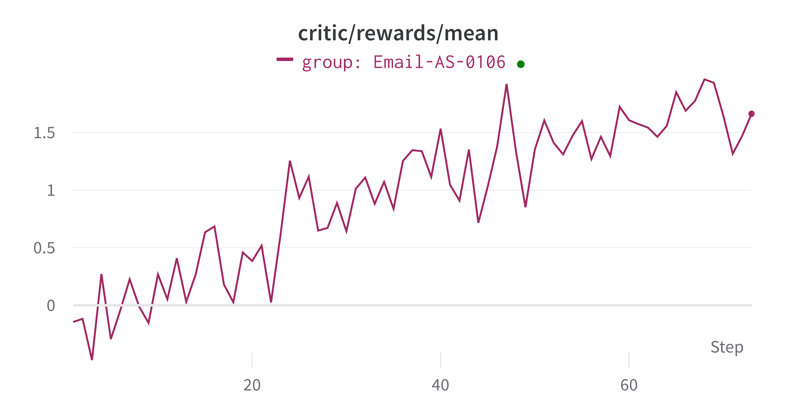

# 使用 AgentScope-Tuner 训练邮件搜索智能体

本示例展示如何使用 AgentScope-Tuner 对邮件搜索任务（灵感来自 [ART](https://openpipe.ai/blog/art-e-mail-agent)）进行强化微调，其 RFT 功能由 [Trinity-RFT](https://github.com/agentscope-ai/Trinity-RFT) 提供支持。

## 任务设定

智能体的目标是通过搜索邮件收件箱来回答用户查询。智能体需要：
- 理解用户的问题
- 使用关键词搜索相关邮件
- 阅读邮件内容以提取信息
- 提供准确的答案并附上适当的来源引用

**智能体类型**：智能体（`EmailSearchAgent`）继承自 `ReActAgent`，遵循推理-行动循环来迭代解决任务。

**环境**：环境是一个包含来自 Enron 邮件数据集的 SQLite 数据库。每个任务提供：
- `question`：用户的邮件搜索查询
- `inbox_address`：要搜索的邮件收件箱
- `query_date`：查询的日期上下文
- `answer`：预期答案（真实值），仅用于奖励计算
- `message_ids`：包含答案的相关邮件 ID，仅用于奖励计算

**可用工具**：
- `search_emails`：通过关键词、收件箱地址和日期范围查找邮件。返回邮件摘要列表（message_id 和片段）。
- `read_email`：通过 message_id 读取特定邮件的完整内容。
- `generate_response`：提供带有来源的最终结构化答案（继承自 ReAct 智能体）。

## 数据集准备

数据集包含基于 [Enron 邮件数据集](https://huggingface.co/datasets/corbt/enron-emails) 的邮件查询。运行数据准备脚本以生成邮件数据库和数据集：

```bash
python prepare_data.py
```

如果你想选择新的数据库路径，可以修改 [`prepare_data.py`](./prepare_data.py) 中的 `DEFAULT_DB_PATH`。同时，请记住在进入下一步之前设置环境变量 `DEFAULT_EMAIL_DB_PATH` 指向数据库路径：

```bash
export DEFAULT_EMAIL_DB_PATH=/path/to/enron_emails_dataset/data/enron_emails.db
```

这将创建一个 SQLite 数据库和数据集：

```
/path/to/enron_emails_dataset/
    ├── data
        └── enron_emails.db     # 邮件数据库
    ├── train.parquet       # 训练样本
    └── test.parquet        # 测试样本
```

每个样本如下所示：

```json
{
  "id": 0,
  "question": "Were there any variances detected for hour 6 on 3/9/01?",
  "answer": "Yes, variances were detected in both Generation and Energy Import/Export schedules for hour 6 on 3/9/01.",
  "message_ids": ["<17407857.1075840601283.JavaMail.evans@thyme>"],
  "how_realistic": 0.800000011920929,
  "inbox_address": "pete.davis@enron.com",
  "query_date": "2001-03-16"
}
```

## 代码实现

本节提供代码实现的高级概览。详细实现请参考源代码。

### 智能体工作流

工作流函数 `run_email_search_agent` 实现智能体-环境交互循环：

```python
async def run_email_search_agent(
    task: Dict,
    model: ChatModelBase,
    auxiliary_models: Dict[str, ChatModelBase],
) -> WorkflowOutput:
    # 解析任务并创建智能体
    agent = EmailSearchAgent(
        name="email_search_agent",
        sys_prompt=system_prompt,
        model=model,
        max_iters=max_turns,
    )

    # 使用结构化输出运行智能体
    response = await agent.reply(
        msg=Msg("user", question, role="user"),
        structured_model=AnswerModel,
    )

    return WorkflowOutput(response=response)
```

智能体遵循 ReAct 模式：它推理任务，调用工具搜索和阅读邮件，最后生成包含答案和来源消息 ID 的结构化响应。

### 评判函数

评判函数 `email_search_judge` 使用 LLM-as-a-Judge 实现奖励计算：

```python
async def email_search_judge(
    task: Dict,
    response: Msg,
    auxiliary_models: Dict[str, ChatModelBase],
) -> JudgeOutput:
    # 从响应中提取答案和来源
    answer = answer_and_sources.get("answer")
    sources = answer_and_sources.get("sources", [])

    # 使用 LLM-as-a-Judge 评判正确性
    judge_model = auxiliary_models.get('judge') or list(auxiliary_models.values())[0]
    judge_response = await judge_correctness(
        answer, query, judge_model
    )

    # 基于以下因素计算奖励：
    # - 答案正确性（准确度：-1.0 到 1.0）
    # - 来源正确性（格式：部分奖励）
    # - 效率（对更少轮次、正确来源的奖励）
    result = {"accuracy": ..., "format": ...}  # 基于 judge_response 计算

    return JudgeOutput(
        reward=sum(result.values()),
        metrics=metrics,
    )
```

奖励函数考虑以下因素：
- **答案正确性**：通过 LLM-as-a-Judge 比较智能体的答案与真实值进行评估
- **来源正确性**：智能体是否引用了正确的邮件消息 ID
- **效率**：对找到/阅读正确邮件和更少轮次的奖励

详细实现请参考 [`main.py`](./main.py) 和 [`email_search_agent.py`](./email_search_agent.py)。

## 运行方法

### 前置要求

- 至少 4 张 NVIDIA GPU，CUDA 版本 ≥ 12.8
  * 注意：对于 30B 评判模型，需要使用至少 4080 显存的 GPU；你也可以通过使用 `tensor_parallel_size > 1` 在多张 GPU 上运行模型以减少显存使用（默认情况下，`tensor_parallel_size=2`）。
- 按照 Trinity-RFT [安装指南](https://agentscope-ai.github.io/Trinity-RFT/zh/main/tutorial/trinity_installation.html) 从源码安装最新版本
- 下载模型检查点（示例）：

  ```bash
  huggingface-cli download Qwen/Qwen3-4B-Instruct-2507
  huggingface-cli download Qwen/Qwen3-30B-A3B-Instruct-2507 # 评判模型
  ```

### 配置

根据你的硬件调整配置文件（[`config.yaml`](./config.yaml)）。关键配置部分包括：

- **TunerModelConfig**：将 `model_path` 设置为你的模型检查点路径
- **AlgorithmConfig**：配置 RL 算法参数（例如，`multi_step_grpo`、学习率、策略损失函数）
- **DatasetConfig**：数据集路径在创建 `DatasetConfig` 对象时在 `main.py` 中指定
- **辅助模型**：为 LLM-as-a-Judge 配置评判模型设置

完整配置详情请参考 [Trinity-RFT 配置指南](https://agentscope-ai.github.io/Trinity-RFT/zh/main/tutorial/trinity_configs.html)。

### 启动命令

1. 准备数据集：

   ```bash
   python prepare_data.py
   export DEFAULT_EMAIL_DB_PATH=/path/to/enron_emails_dataset/data/enron_emails.db
   ```

2. 启动 [Ray](https://github.com/ray-project/ray)：

   ```bash
   ray start --head
   ```

3. 运行训练脚本：

   ```bash
   python main.py
   ```

## 实验结果

### 定量结果

训练结果显示智能体性能随训练迭代次数的提升。关键指标包括：

- **训练奖励**：训练样本上的平均奖励随着智能体学习更好的策略而增加
- **Rollout 准确度**：Rollout 样本上的平均准确度随着智能体学习更好的策略而增加

<div align="center">
  
</div>

<div align="center">
  
</div>


### 具体示例

智能体行为示例如下：

**查询：** "What do the color codes mean in the curve assessment?"

我们展示智能体响应的最后几轮：

智能体执行多次搜索尝试以找到相关邮件。经过一些不成功的搜索后，智能体尝试：

**工具调用：**
```json
{
  "type": "tool_use",
  "name": "search_emails",
  "input": {
    "inbox_address": "steven.kean@enron.com",
    "query_date": "2001-04-03",
    "keywords": ["curve", "assessment"]
  }
}
```

**工具结果：**
```json
{
  "type": "tool_result",
  "name": "search_emails",
  "output": [
    {
      "message_id": "<2654330.1075846153519.JavaMail.evans@thyme>",
      "snippet": "... curves and Senior Management as necessary.\\n\\n<b>Curve Assessment</b>\\n Green: \\n  - curve is reasonable\\n  - small P&L ..."
    },
    {
      "message_id": "<12499967.1075846153495.JavaMail.evans@thyme>",
      "snippet": "... curves and Senior Management as necessary.\\n\\n<b>Curve Assessment</b>\\n Green: \\n  - curve is reasonable\\n  - small P&L ..."
    }
  ]
}
```

找到相关邮件后，智能体使用 `read_email` 工具读取两封邮件的完整内容：

**工具调用：**
```json
{
  "type": "tool_use",
  "name": "read_email",
  "input": {
    "message_id": "<2654330.1075846153519.JavaMail.evans@thyme>"
  }
}
```

**工具调用：**
```json
{
  "type": "tool_use",
  "name": "read_email",
  "input": {
    "message_id": "<12499967.1075846153495.JavaMail.evans@thyme>"
  }
}
```

阅读邮件后，智能体生成最终的结构化响应：

**工具调用：**
```json
{
  "type": "tool_use",
  "name": "generate_response",
  "input": {
    "answer": "In the curve assessment, the color codes are used as follows:\n- Green: The curve is considered reasonable, and the P&L (profit and loss) is small.",
    "sources": [
      "<2654330.1075846153519.JavaMail.evans@thyme>",
      "<12499967.1075846153495.JavaMail.evans@thyme>"
    ]
  }
}
```

评判器评估上面的答案为正确。
