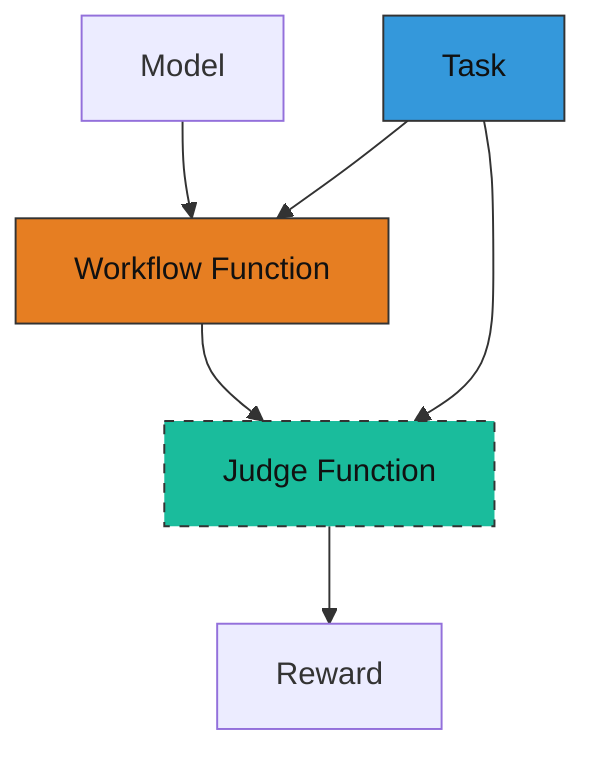

# 数学智能体（AgentScope Tuner 快速上手）

AgentScope 提供了 `tuner` 子模块，使用强化学习（RL）来训练智能体工作流。
本实例展示了如何用 AgentScope Tuner 调优一个数学题求解智能体，以提升其解题能力。

## 总览

要用 AgentScope Tuner 训练你的智能体工作流，你需要理解以下三个组件：

1. **工作流函数（Workflow Function）**：将你的智能体应用重构为符合指定输入/输出签名的工作流函数。
2. **评判函数（Judge Function）**：实现一个评判函数，根据智能体的响应计算奖励。
3. **任务数据集（Task Dataset）**：准备包含训练样本的数据集，供智能体学习。

下图展示了这些组件之间的关系：



工作流函数（Workflow Function）接收一个模型（Model）和来自任务数据集的任务（Task）作为输入，输出智能体的原始响应。
评判函数（Judge Function）接收同样的任务和智能体响应作为输入，计算一个标量奖励（Reward）。
评判函数是可选的，工作流函数本身可以直接输出奖励以跳过评判函数。

## 如何实现

这里以数学题求解场景为例，说明如何实现上述三个组件。

假设你有一个用 `ReActAgent` 解决数学题的智能体工作流。

```python
from agentscope.agent import ReActAgent
from agentscope.model import OpenAIChatModel
from agentscope.formatter import OpenAIChatFormatter
from agentscope.message import Msg

async def run_react_agent(query: str):
    model = OpenAIChatModel(
        # 你的模型配置...
    )

    agent = ReActAgent(
        name="react_agent",
        sys_prompt="你是一个乐于助人的数学题解答智能体。",
        model=model,
        enable_meta_tool=True,
        formatter=OpenAIChatFormatter(),
    )

    response = await agent.reply(
        msg=Msg("user", query, role="user"),
    )

    print(response)
```

### 步骤 1：准备任务数据集（Task Dataset）

要训练智能体解决数学题，你需要一个包含数学题及其标准答案的训练数据集。

数据集应使用 huggingface [datasets](https://huggingface.co/docs/datasets/quickstart) 格式，并可通过 `datasets.load_dataset` 加载。例如：

```
my_dataset/
    ├── train.jsonl  # 训练样本
    └── test.jsonl   # 测试样本
```

假设你的 `train.jsonl` 内容如下：

```json
{"question": "2 + 2 等于多少？", "answer": "4"}
{"question": "4 + 4 等于多少？", "answer": "8"}
```

注意，任务样本格式可根据你的具体场景变化。关键是每个样本应包含智能体完成任务和评价任务完成效果所需的信息。

你可以用如下代码预览数据集：

```python
from agentscope.tuner import DatasetConfig

DatasetConfig(path="my_dataset", split="train").preview()

# 输出：
# [
#   {
#     "question": "2 + 2 等于多少？",
#     "answer": "4"
#   },
#   {
#     "question": "4 + 4 等于多少？",
#     "answer": "8"
#   }
# ]
```

### 步骤 2：定义工作流函数（Workflow Function）

要用 AgentScope Tuner 训练智能体工作流，需要实现如下函数接口：

```python
async def workflow_function(
    task: Dict,
    model: OpenAIChatModel,
    auxiliary_models: Optional[Dict[str, OpenAIChatModel]]=None,
) -> WorkflowOutput:
    """在单个任务上运行智能体工作流并返回标量奖励。"""
```

- 输入：
    - `task`：表示单个训练任务的字典，由训练数据集的样本转换而来。例如，若用上一步准备的数据集，`task` 字典包含 `question` 和 `answer` 字段。
    - `model`：`ChatModelBase` 实例，接口与 `OpenAIChatModel` 相同，支持自动将调用历史转为可训练数据。
    - `auxiliary_models`：辅助模型字典，键为模型名，值为 `ChatModelBase` 实例。这些模型不会直接训练，可辅助主模型完成任务（如充当 Judge）。如无需辅助模型则为空字典。

- 输出：
    - `WorkflowOutput`：包含工作流函数输出的对象，包括：
        - `reward`：标量浮点数，表示工作流函数获得的奖励。如果希望工作流函数直接输出奖励则填写，否则可留空，由评判函数计算。
        - `response`：工作流函数的输出，可为智能体响应或其他类型，供评判函数计算奖励。如无需评判函数可留空。
        - `metrics`：训练过程中可记录的其他指标字典。如无可留空。

如下示例展示了如何将原有 `run_react_agent` 函数改造为工作流函数。

**仅有 3 处小改动**：

1. 用输入的 `model` 初始化智能体。
2. 用 `task` 字典的 `question` 字段作为用户问题。
3. `WorkflowOutput` 对象包装原始返回值。

```python
from typing import Dict
from agentscope.agent import ReActAgent
from agentscope.model import OpenAIChatModel
from agentscope.formatter import OpenAIChatFormatter
from agentscope.tuner import WorkflowOutput
from agentscope.message import Msg

async def run_react_agent(
    task: Dict,
    model: OpenAIChatModel,
    auxiliary_models: Dict[str, OpenAIChatModel] | None = None,
) -> WorkflowOutput:
    agent = ReActAgent(
        name="react_agent",
        sys_prompt="你是一个乐于助人的数学题解答智能体。",
        model=model,  # 直接用可训练模型
        formatter=OpenAIChatFormatter(),
    )

    response = await agent.reply(
        msg=Msg("user", task["question"], role="user"),  # 从 task 提取问题
    )

    return WorkflowOutput(  # 将响应放入 WorkflowOutput
        response=response,
    )
```

### 步骤 3：实现评判函数

评判函数用于根据工作流函数的输出计算奖励。你需要实现如下函数接口：

```python
async def judge_function(
    task: Dict,
    response: Any,
    auxiliary_models: Dict[str, ChatModelBase],
) -> JudgeOutput:
    """根据输入任务和工作流函数的返回值计算奖励。"""
```

- 输入：
    - `task`：单个训练任务的字典，与工作流函数输入相同。
    - `response`：工作流函数输出的 response 域，数据类型取决于你的工作流函数的具体实现。
    - `auxiliary_models`：辅助模型字典，键为模型名，值为 `ChatModelBase` 实例。这些模型不会直接训练，可作为评委辅助奖励计算。如无需辅助模型留空即可。

- 输出：
    - `JudgeOutput`：包含评判函数输出的对象，包括：
        - `reward`：根据输入任务和智能体响应计算的标量浮点奖励。此字段必须填写。
        - `metrics`：训练过程中可记录的其他指标字典。如无可留空。

下面是一个简单奖励机制的实现示例：若智能体答案与标准答案完全一致则奖励为 `1.0`，否则为 `0.0`。

> 注意：该函数仅为示例，实际应用中你需要解析智能体响应以提取最终答案再与标准答案比较，或采用更复杂的奖励计算方法。

```python
from agentscope.message import Msg
from agentscope.tuner import JudgeOutput

async def judge_function(
    task: Dict, response: Msg, auxiliary_models: Dict[str, ChatModelBase]
) -> JudgeOutput:
    """简单奖励：如果回复中包含标准答案则为 1.0 否则为 0.0。"""
    ground_truth = task["answer"]
    reward = 1.0 if ground_truth in response.get_text_content() else 0.0
    return JudgeOutput(reward=reward)
```

> 提示：你可以利用已有的 [`MetricBase`](https://github.com/agentscope-ai/agentscope/blob/main/src/agentscope/evaluate/_metric_base.py) 实例实现评判函数，通过组合多个 Metric 计算更复杂的奖励指标。

### 步骤 4：开始调优

最后，你可以用 `tune` 接口结合一些配置信息训练上面定义的工作流函数。

```python
from agentscope.tuner import tune, AlgorithmConfig, DatasetConfig, TunerModelConfig

# 你的工作流 / 评判函数 ...

if __name__ == "__main__":
    dataset = DatasetConfig(path="my_dataset", split="train")
    model = TunerModelConfig(model_path="Qwen/Qwen3-0.6B", max_model_len=16384)
    algorithm = AlgorithmConfig(
        algorithm_type="multi_step_grpo",
        group_size=8,
        batch_size=32,
        learning_rate=1e-6,
    )
    tune(
        workflow_func=run_react_agent,
        judge_func=judge_function,
        model=model,
        train_dataset=dataset,
        algorithm=algorithm,
    )
    # 高级用法：可传入 config_path 来从 YAML 文件加载配置，忽略其他参数
    # tune(
    #     workflow_func=run_react_agent,
    #     judge_func=judge_function,
    #     config_path="config.yaml",
    # )
```

这里用 `DatasetConfig` 加载训练数据集，`TunerModelConfig` 初始化可训练模型，`AlgorithmConfig` 指定 RL 算法及其超参数。

> 注意：
> `tune` 函数基于 [Trinity-RFT](https://github.com/modelscope/Trinity-RFT) 实现，会将输入参数自动转为 YAML 配置。
> 高级用户可忽略 `model`、`train_dataset`、`algorithm` 参数，直接用 `config_path` 指定 YAML 配置文件（见 [config.yaml](./config.yaml) 示例）。
> 推荐用配置文件方式实现更细粒度的训练控制，充分利用 Trinity-RFT 的高级特性。
> 详细配置说明见 Trinity-RFT [配置指南](https://modelscope.github.io/Trinity-RFT/zh/main/tutorial/trinity_configs.html)。

训练产生的 checkpoint 和日志信息会自动保存在当前目录下的 `checkpoints/AgentScope` 中，每次运行会新建带时间戳的子目录。
TensorBoard 日志在 checkpoint 目录下的 `monitor/tensorboard` 中。

```
math_agent/
    └── checkpoints/
        └──AgentScope/
            └── Experiment-20260104185355/  # 每次运行新建带时间戳的子目录
                ├── monitor/
                │   └── tensorboard/  # tensorboard 日志
                └── global_step_x/    # 第 x 步保存的模型 checkpoint
```

---

### 完整示例

```python
from typing import Dict

from agentscope.tuner import tune, WorkflowOutput, JudgeOutput, DatasetConfig, TunerModelConfig, AlgorithmConfig
from agentscope.agent import ReActAgent
from agentscope.model import OpenAIChatModel
from agentscope.formatter import OpenAIChatFormatter
from agentscope.message import Msg

async def run_react_agent(
    task: Dict,
    model: OpenAIChatModel,
    auxiliary_models: Dict[str, OpenAIChatModel],
) -> WorkflowOutput:
    agent = ReActAgent(
        name="react_agent",
        sys_prompt="你是一个乐于助人的数学题解答智能体。",
        model=model,
        formatter=OpenAIChatFormatter(),
    )

    response = await agent.reply(
        msg=Msg("user", task["question"], role="user"),  # 从 task 提取问题
    )

    return WorkflowOutput(
        response=response,
    )

async def judge_function(
    task: Dict, response: Msg, auxiliary_models: Dict[str, OpenAIChatModel]
) -> JudgeOutput:
    """简单奖励：如果回复中包含标准答案则为 1.0 否则为 0.0。"""
    ground_truth = task["answer"]
    reward = 1.0 if ground_truth in response.get_text_content() else 0.0
    return JudgeOutput(reward=reward)

if __name__ == "__main__":
    dataset = DatasetConfig(path="my_dataset", split="train")
    model = TunerModelConfig(model_path="Qwen/Qwen3-0.6B", max_model_len=16384)
    algorithm = AlgorithmConfig(
        algorithm_type="multi_step_grpo",
        group_size=8,
        batch_size=32,
        learning_rate=1e-6,
    )
    tune(
        workflow_func=run_react_agent,
        judge_func=judge_function,
        model=model,
        train_dataset=dataset,
        algorithm=algorithm,
    )
```

> 注意：
> 上述代码仅为简化示例，完整实现请参考 [main.py](./main.py)，该文件演示了如何在 GSM8K 数据集上训练 ReAct 智能体解决数学题。

---

## 如何运行

实现好工作流函数后，按以下步骤运行训练：

1. 前置条件

    - 至少 2 块 NVIDIA GPU，CUDA 12.8 或更高。
    - 根据硬件调整配置文件（[config.yaml](./config.yaml)）。
    - 按 Trinity-RFT [安装指南](https://modelscope.github.io/Trinity-RFT/zh/main/tutorial/trinity_installation.html) 从源码安装最新版。
    - 下载 GSM8K 数据集和 Qwen/Qwen3-0.6B 模型权重（示例）：

      ```bash
      huggingface-cli download openai/gsm8k --repo-type dataset
      huggingface-cli download Qwen/Qwen3-0.6B
      ```

2. 启动 [Ray](https://github.com/ray-project/ray) 集群

    ```bash
    ray start --head
    # 多节点时，worker 节点运行如下命令
    # ray start --address=<master_address>
    ```

3. 运行训练脚本

    ```bash
    python main.py
    ```

4. 用 TensorBoard 监控奖励曲线等训练指标：

    ```bash
    tensorboard --logdir ./checkpoints/AgentScope/Experiment-xxxxxx/monitor/tensorboard
    ```

    奖励曲线示例：

    
