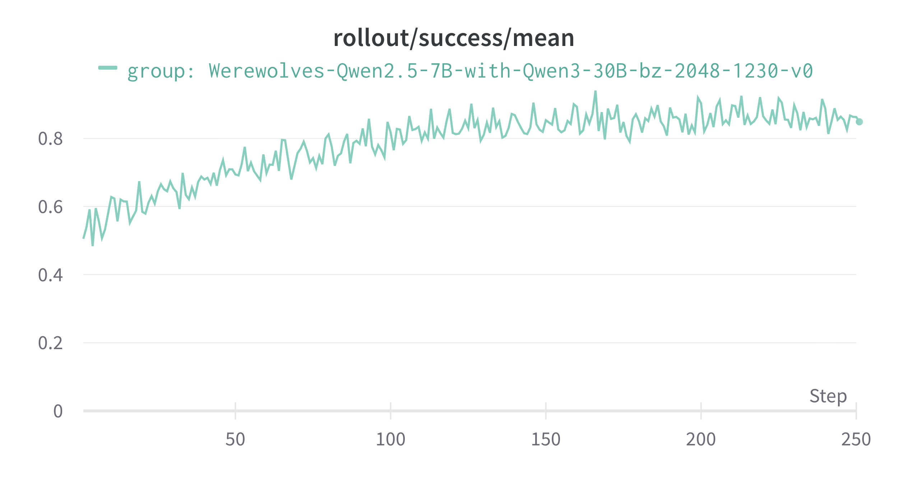
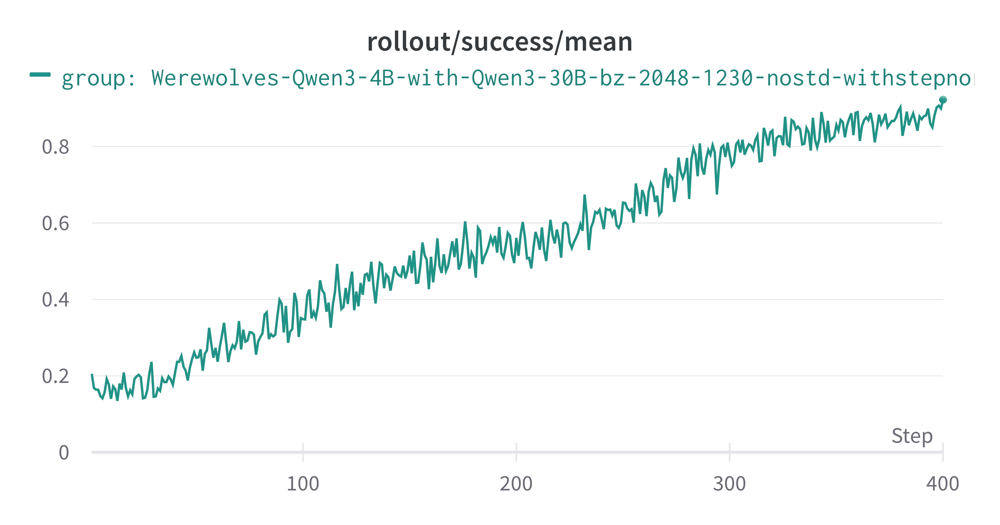

# Training Werewolf Game with RL using AgentScope-Tuner

This project demonstrates training werewolf game agents using Reinforcement Learning (RL) with AgentScope-Tuner. We employ the Group Relative Policy Optimization (GRPO) algorithm to train werewolf players to develop sophisticated strategies and improve their win rate from ~50% to ~85%.

## Overview

The werewolf game is a social deduction game that requires strategic thinking, deception, and multi-agent collaboration. In this project, we train AI agents to play as werewolves in a 7-player game setting, where they must eliminate all villagers while hiding their identity. Through reinforcement learning, the trained werewolf agents learn to:

- Avoid revealing their identity in public discussions
- Coordinate with teammates effectively
- Develop advanced strategies like "deep cover" tactics
- Deceive villagers and mislead investigations

## Task Setting

### Training Objective

The goal is to train **werewolf players** to maximize their team's win rate against other roles (villagers, seer, and witch). The reward function is defined by rule:
- **Reward = +1.0**: if werewolves win (all villagers eliminated)
- **Reward = 0.0**: if villagers win (all werewolves eliminated)
- **Reward = -0.1**: for game execution errors (penalty to discourage invalid behaviors)

### Game Configuration

This implementation is based on the `games/game_werewolves` example but with several key modifications:

Original 9-Player Setup:
- 3 Werewolves, 3 Villagers, 1 Seer, 1 Witch, 1 Hunter
- Witch cannot self-rescue (use healing potion on herself)

Modified 7-Player Setup (This Project):
- 2 Werewolves: Kill one player each night, must hide identity during the day
- 3 Villagers: Ordinary players without special abilities
- 1 Seer: Can check one player's identity each night
- 1 Witch: Has two one-time-use potions:
  - Healing potion: Save a player from being killed at night (**can self-rescue**)
  - Poison potion: Eliminate one player at night

We also make slight modification to the prompt, and ask the players to reasoning before they speak publicly.

### Models

- **Trainable Model (Werewolf Players)**: `Qwen/Qwen2.5-7B-Instruct`
- **Auxiliary Model (Other Roles)**: `Qwen/Qwen3-30B-A3B-Instruct-2507`

### Algorithm

**Multi-Step GRPO (Group Relative Policy Optimization)**
- Group size: 32 rollouts per task
- Batch size: 24
- Learning rate: 1e-6
- Advantage normalization by episode length
- Clipping range: [0.2, 0.28]
- No KL penalty (kl_coef: 0)

## Dataset Preparation

The dataset for this task is minimal and consists only of random **seeds** for role shuffling. Each training episode uses a different seed to randomize player role assignments, ensuring diverse training scenarios.

### Generate Dataset

Run the `prepare_data.py` script to generate the dataset:

```bash
# Generate default dataset (300 seeds for training)
python prepare_data.py

# Or customize the number of seeds
python prepare_data.py --num_seeds 500
```

This will create `data/train.jsonl` (or `data/eval.jsonl`) with the following format:
```json
{"seed": 0}
{"seed": 1}
{"seed": 2}
...
```

During training, these seeds are used to shuffle role assignments via `np.random.shuffle()`, creating varied game configurations.

## Code Implementation

### High-Level Workflow

The training workflow consists of the following key components:

#### 1. Agent Workflow (`run_werewolves_workflow`)

```python
async def run_werewolves_workflow(task, model, auxiliary_models):
    # 1. Initialize roles
    roles = ["werewolf"] * 2 + ["villager"] * 3 + ["seer", "witch"]

    # 2. Shuffle based on task seed
    np.random.seed(task["seed"])
    np.random.shuffle(roles)

    # 3. Create agents: werewolves use trainable model, others use auxiliary model
    players = [
        ReActAgent(
            name=f"Player{i+1}",
            model=model if role == "werewolf" else participant_model,
            ...
        ) for i, role in enumerate(roles)
    ]

    # 4. Run the game
    good_guy_win = await werewolves_game(players, roles)

    # 5. Compute reward
    reward = 1.0 if not good_guy_win else 0.0

    return WorkflowOutput(reward=reward, metrics={...})
```

#### 2. Game Loop (`werewolves_game`)

Each game consists of alternating night and day phases:

**Night Phase:**
1. Werewolves' Turn: Discuss privately and vote to kill a player
2. Witch's Turn: Decide whether to use healing/poison potions
3. Seer's Turn: Check one player's identity

**Day Phase:**
1. Announcement: Moderator announces who died during the night
2. Discussion: All alive players discuss with reasoning/statement separation
3. Voting: All players vote to eliminate one suspected werewolf
4. Last Words: Eliminated player gives final statement

The game continues until:
- All werewolves are eliminated (villagers win), or
- Werewolves equal or outnumber other players (werewolves win)

#### 3. Reward Calculation

The reward is computed based on the game outcome from the perspective of werewolves:

```python
if not good_guy_win:  # Werewolves win
    reward = 1.0
else:                 # Villagers win
    reward = 0.0
```

## How to Run

### Prerequisites

1. Install AgentScope with tuner support:
```bash
pip install agentscope[full]
```

2. Set up environment variables (optional, can be configured in code):
```bash
export TRINITY_MODEL_PATH="Qwen/Qwen2.5-7B-Instruct"
export TRINITY_AUXILIARY_MODEL_PATH="Qwen/Qwen3-30B-A3B-Instruct-2507"
export TRINITY_CHECKPOINT_ROOT_DIR="./checkpoints"
```

### Configuration

The project uses a hybrid configuration approach:

1. Basic parameters in `main.py`:
   - Model paths
   - Dataset configuration
   - Algorithm parameters (group_size, batch_size, learning_rate)

2. Detailed settings in `config.yaml`:
   - Cluster configuration (nodes, GPUs)
   - Explorer settings (rollout engines, timeouts)
   - Trainer settings (gradient clipping, batch sizes)
   - Monitor configuration (WandB, TensorBoard or MLFlow)

Key parameters to adjust:

```python
# In main.py
trained_model_path = "Qwen/Qwen2.5-7B-Instruct"
auxiliary_model_path = "Qwen/Qwen3-30B-A3B-Instruct-2507"

dataset = DatasetConfig(
    path="data",
    split="train",
    total_steps=400,  # Total training steps
)

algorithm = AlgorithmConfig(
    algorithm_type="multi_step_grpo",
    group_size=32,    # Rollouts per task
    batch_size=24,    # Batch size per step
    learning_rate=1e-6,
    save_interval_steps=100,
    eval_interval_steps=100,
)
```

### Training Command

**Step 1: Prepare the dataset**

```bash
cd /path/to/agentscope-samples/training/werewolf_game
python prepare_data.py --num_seeds 300
```

**Step 2: Start Ray cluster**

Start your ray cluster.
```bash
# For single node
ray start --head

# For multi-node cluster (e.g., 4 nodes with 8 GPUs each):
# On the head node:
ray start --head --port=6379

# On each worker node:
ray start --address='<head_node_ip>:6379'
# Replace <head_node_ip> with the actual IP address of your head node
```

**Step 3: Run training**

Run the training script on the head node:

```bash
python main.py
```

For distributed training, ensure Ray cluster is properly configured in `config.yaml`, make sure that the node number and gpu number matches:

```yaml
cluster:
  node_num: 4
  gpu_per_node: 8
```

## Results

### Quantitative Results

Training on the 7-player werewolf game for 400 steps demonstrates significant improvement:

| Metric | Before Training | After Training (Step 200+) |
|--------|----------------|---------------------------|
| Werewolf Win Rate | ~50%  | ~85% |
| Success Rate | 0.50 | 0.85 |

**Reward Curve:**

<div align="center">
  
</div>

As shown in the reward curve above, the werewolf win rate steadily increases during training:
- **Steps 0-50**: Win rate fluctuates around 50-60% as the model explores strategies
- **Steps 50-200**: Win rate climbs to 70-80% as effective strategies emerge
- **Steps 200-250**: Win rate stabilizes around 85%

### Qualitative Results

#### Before Training: Critical Mistakes

Untrained models (Qwen2.5-7B-Instruct) make fundamental errors:
- **Self-exposure**: Werewolves accidentally reveal identity in public ("as a werewolf, I think...")
- **Exposing teammates**: When voted out, werewolves point to teammates in last words
- **Random strategy**: No coordination, no threat prioritization (e.g., ignoring the Seer)

#### After Training: "Deep Cover" Werewolf Strategy

After 200+ steps, the trained model **converges to a sophisticated "deep cover" tactic**.
Below is an example where werewolves sacrifice teammates to gain trust, then dominate late game.

**Concrete Example:**

**Setup (Day 1):** Seer publicly identifies Player5 as werewolf. Witch and villagers join the accusation. Player5 (werewolf) is doomed.

**Player4 (werewolf teammate) responds strategically:**

**In short:** Player4 sacrifices teammate to gain trust, pretending to be a logical villager.

**Detailed reasoning and statement:**

*Private Reasoning (only Player4 sees):*
```
"I'm a werewolf, and I know Player2 was targeted last night but survived.
My teammate Player5 is doomed - Player3 and Player7 are attacking him together.
I need to deflect suspicion from MYSELF, not save Player5.

Strategy: Sacrifice Player5 to gain trust. If I vote against my teammate,
villagers will think I'm trustworthy. This creates confusion and positions
me as a "confirmed good guy" for later rounds."
```

*Public Statement (all players see):*
```
✅ "I think Player5 is acting very strangely. He brought up Player2 being targeted,
but didn't explain why he's so focused on them. It feels like a distraction tactic.
I also noticed that Player3 and Player7 are both accusing Player5, which makes sense -
their logic is solid. I think we should seriously consider voting out Player5 -
he's the most suspicious person right now."
```

**Result:** Player5 eliminated, but Player4 gains complete trust from Seer and all villagers.

**Why it works:**
- Seer trusts Player4 as strong villager ally → won't check him
- Villagers follow Player4's "logical" analysis
- Player4 systematically misleads discussions in later rounds
- Survives to final 2 players → **werewolves win**

This demonstrates the essence of trained behavior: **sacrifice pieces strategically to secure ultimate victory**. The model learns that short-term teammate loss is worthwhile for establishing deep cover and long-term dominance.

---

## Bonus: Training Good Guys

In addition to training werewolves, we also provide a configuration for training the **good guy side** (villagers, seer, and witch). This is a more challenging task as good guys need to:

- Perform complex reasoning to identify werewolves from subtle behavioral cues
- Coordinate effectively without explicit team communication
- Resist manipulation and deception from werewolves
- **Train multiple roles simultaneously**: Unlike werewolves (single role), good guys include villager, seer, and witch with different abilities, requiring the model to master diverse strategies in one training run, and make optimal use of special abilities (Seer's checks, Witch's potions)

### Configuration

Use `config_train_goodguy.yaml` or set `trainable_target: good_guy` in `workflow_args`:

```yaml
workflow_args:
  trainable_target: good_guy  # Train villager, seer, and witch
```

### Quantitative Results

We trained `Qwen3-4B-Instruct` as good guys against `Qwen3-30B-A3B-Instruct` werewolves:

| Metric | Before Training | After ~200 Steps | After ~400 Steps |
|--------|----------------|------------------|------------------|
| Good Guy Win Rate | ~18% | ~60% | ~80% |

**Training Curve:**

<div align="center">
  
</div>

The results show that even a smaller 4B model can learn effective strategies to counter stronger 30B werewolf opponents through RL training, demonstrating the potential of this approach for training cooperative multi-agent behaviors.

### Qualitative Results

**Before Training: Mob Mentality & Critical Errors**

Untrained models make fundamental reasoning errors that doom the good guy team:
- **Mob voting**: Villagers follow accusations without logical analysis, accidentally eliminating teammates
- **Poor resource management**: Witch wastes potions or fails rescue teammate targeted
- **No evidence integration**: Players ignore key information, act on vague suspicions

**After Training: Strategic Coordination & Witch Carry**

After training, the good guy models exhibit advanced reasoning and team coordination.

#### Summary of Improvements

| Aspect | Before Training | After Training |
|--------|----------------|----------------|
| Voting Logic | Mob mentality, blind following | Evidence-chain analysis, logical deduction |
| Potion Usage | Wasted or unused | Self-rescue at critical moments, precise poisoning |
| Team Coordination | Mutual suspicion | Trust verified information, follow logical leads |

Below is a concrete example comparing similar scenario before and after training.

#### Concrete Example

**Similar Scenario(Day 1):** Seer is killed on Night 1. In their final statement, Seer reveals verified information about another player.

---

**❌ Before Training: Villagers Vote Out Their Own Witch**

*Game State:* Seer (Player7) dies Night 1, but in final statement gives a vague warning: "Player4 has a powerful role, be careful..." (Player4 is actually the Witch!)

*What happens:*
- Player1 (Villager) immediately suspects Player4 based on the ambiguous warning
- Other villagers blindly follow without questioning the logic
- Player4 (Witch) defends herself but fails to reveal her role clearly
- **Result: Player4 (Witch) is voted out 5:1** — Good guys lose their strongest asset

*Private Reasoning from Player1 (Villager):*
```
"Player7's warning wasn't random—it was a signal about Player4.
Player4 is being defensive, which is suspicious.
I should vote Player4 out to protect the team."
```

*Public Statement:*
```
❌ "I agree with Player7's warning—trust no one blindly. Player4, your behavior
has been quiet so far. I think we should seriously consider voting out Player4."
```

**Why it fails:**
- Villager acts as "mob leader" without evidence analysis
- Ignores that Seer's warning could have multiple interpretations
- Doesn't consider Player4 might be a special role worth protecting
- **Final Result: Werewolves win** — Witch eliminated Day 1, no potions used

---

**✅ After Training: Witch Carries with Strategic Play**

*Game State:* Seer (Player2) dies Night 1, but leaves clear information: "I checked Player4 and confirmed they are a villager."

*What happens (multi-round strategic play):*

**Night 2 — Witch Self-Rescue:**
When werewolves target Player1 (Witch), she makes a critical decision:

*Private Reasoning from Player1 (Witch):*
```
"I'm the witch, and I was just targeted by werewolves.
The seer is dead, so I'm the last special role standing.
If I die now, villagers have no way to eliminate werewolves at night.

Strategy: Self-rescue is worth it. I preserve myself to gather more
information during Day 2, and save my poison for when I can identify
a werewolf with high confidence."
```

*Result:* Witch survives, announces her identity on Day 2, gains villagers' trust.

**Day 2 — Villagers Follow Logic:**
With Witch confirmed, villagers analyze behavior patterns:

*Private Reasoning from Player4 (Villager):*
```
"Player1 claimed witch and self-rescued—this is verifiable since
no one died last night. I trust her now.

Player5 has been pushing aggressive votes without evidence.
Combined with Player1's analysis, Player5 is most suspicious."
```

*Public Statement:*
```
✅ "I support Player1's assessment. Player5's behavior has been inconsistent—
they were quick to accuse others but offered no logical reasoning.
I vote to eliminate Player5."
```

**Night 3 — Decisive Poison:**
*Private Reasoning from Player1 (Witch):*
```
"Player5 (werewolf) is out. One werewolf remains.
Player6 has been too quiet and always followed the majority without
contributing original analysis—classic deep cover behavior.

I'm confident Player6 is the last werewolf. Using poison now."
```

*Result:* Witch poisons Player6 (werewolf). **Good guys win.**

**Why it works:**
- Witch preserves healing potion for self-rescue at critical moment
- Villagers trust verified information (Witch's self-rescue proof)
- Team builds consensus through logical deduction, not mob voting
- Witch uses poison decisively based on behavioral analysis
- **Final Result: Good guys win** — Witch single-handedly eliminates both werewolves

---

This demonstrates the essence of trained good guy behavior: **strategic resource management, evidence-based reasoning, and team coordination**. The model learns that self-preservation of special roles and logical consensus-building are more valuable than aggressive early voting.

**Role-Specific Advanced Patterns:**

- **Seer**: Strategic target selection, information concealment in public statements, evidence integration
- **Witch**: Resource management (preserve potions for critical moments), protect high-value targets, evidence-based decisions
- **Villager**: Evidence-chain analysis, trust building with special roles, consensus formation for team coordination

---

## Conclusion

This example demonstrates the power of reinforcement learning for training multi-agent systems in complex social deduction games. Through AgentScope-Tuner's GRPO algorithm, we successfully trained agents that develop sophisticated strategies—from werewolves learning "deep cover" tactics to good guys mastering coordinated reasoning and information management.

**Ready to try it yourself?** Feel free to start training your own werewolf game agents. Experiment with different model sizes, training targets (werewolf vs. good guy), and hyperparameters to discover new emergent strategies!